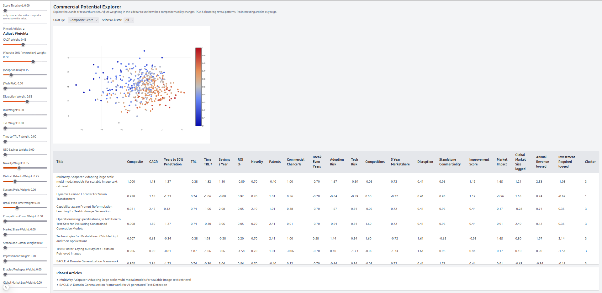

# Commercial Potential Explorer

A **Next.js 13** (TypeScript) application for exploring a **rich dataset** of research or technology innovations. Users can **dynamically weight** multiple metrics (risk, ROI, time-to-market, etc.) to compute a **composite viability score**. The interface applies **PCA** & **K-means** clustering to help you quickly **visualize**, **filter**, and **pin** articles with the highest commercial potential.

  

## Table of Contents

- [Features](#features)
- [Tech Stack](#tech-stack)
- [Project Structure](#project-structure)
- [Prerequisites](#prerequisites)
- [Installation](#installation)
- [Generate Sample Data](#generate-sample-data)
- [Development](#development)
- [Usage](#usage)
- [Deployment](#deployment)
- [Customization](#customization)
- [License](#license)

---

## Features

1. **Rich Dataset**  
   - Handles 20+ numeric metrics per article (e.g. CAGR, TRL, adoption risk, novelty, etc.).
   - Computed “composite score” dynamically based on user-defined slider weights.

2. **Dimensionality Reduction + Clustering**  
   - **PCA** to reduce multiple metrics to a 2D scatterplot.  
   - **K-means** to automatically group similar articles into “cohorts.”

3. **Interactive UI**  
   - **React-Plotly** scatterplot with hover & click for detail.  
   - **Sidebar** with multiple sliders.  
   - **Threshold** slider for filtering out articles below a certain score.  
   - **Article Table** for deeper inspection of each row.  
   - **Pin/Unpin** items for quick reference.

4. **Single-Page Experience**  
   - All features (sliders, plot, table, detail modal) on a single integrated page.  
   - Next.js 13 **app directory** for easy routing and file-based structure.  
   - TypeScript for type safety.

---

## Tech Stack

- **Framework**: [Next.js 13](https://nextjs.org/) with **App Router**  
- **Language**: [TypeScript](https://www.typescriptlang.org/)  
- **UI & Styling**: [React](https://reactjs.org/) + [Tailwind CSS](https://tailwindcss.com/)  
- **Charts**: [react-plotly.js](https://github.com/plotly/react-plotly.js) + [plotly.js](https://plotly.com/javascript/)  
- **Data Science**: [ml-pca](https://www.npmjs.com/package/ml-pca) + [ml-kmeans](https://www.npmjs.com/package/ml-kmeans)  
- **Deployment**: Supports free hosting on Vercel, Netlify, etc.

---

## Project Structure

Below is a typical layout:

```
.
├── package.json
├── tsconfig.json
├── postcss.config.mjs
├── tailwind.config.ts
├── next.config.ts
├── public
│   ├── data.json
│   └── ...
├── src
│   ├── app
│   │   ├── layout.tsx
│   │   └── page.tsx
│   └── components
│       ├── Sidebar.tsx
│       ├── ScatterPlot.tsx
│       ├── ArticleTable.tsx
│       ├── DetailModal.tsx
│       └── types.ts
├── generate_data.ts
└── README.md
```

- **public/**: Static assets (including `data.json`).
- **src/app/**: Next.js **app directory**. `page.tsx` is the main interface. `layout.tsx` sets global layout.
- **src/components/**: Reusable React components (sidebar, table, plot, etc.).
- **generate_data.ts**: Script to generate synthetic data.

---

## Prerequisites

- **Node.js** v16+ (recommended v18+).  
- **npm** or **yarn** for package management.

---

## Installation

1. **Clone** the repository:
   ```bash
   git clone https://github.com/<your-user>/<your-repo>.git
   cd <your-repo>
   ```
2. **Install** dependencies:
   ```bash
   npm install
   ```
   or
   ```bash
   yarn install
   ```

---

## Development

Run the development server:

```bash
npm run dev
```

Then open [http://localhost:3000](http://localhost:3000) in your browser. You should see:

1. A **sidebar** with multiple sliders for different metrics.  
2. A **scatterplot** (PCA) that updates or re-renders when you tweak weights.  
3. A **threshold** slider that filters out lower-scoring articles.  
4. A **table** of the currently filtered articles.  
5. A **detail modal** when you click a row or point.  
6. A **pinned articles** list.

---

## Usage

1. **Adjust Sliders**: Move the slider knobs in the sidebar (CAGR, time-to-penetration, etc.) to reflect **your priorities**.  
2. **Threshold**: Increase the “Score Threshold” to focus only on top-scoring articles.  
3. **PCA Scatter**: Hover or click any point to see the article’s title and snippet.  
4. **Cluster Selection**: Use the “Select a Cluster” dropdown to filter by K-means cluster.  
5. **Drill-Down**: The table at the bottom lists the currently visible subset. Click any row for a detailed view.  
6. **Pin/Unpin**: In the detail modal, pin articles you find interesting for side-by-side comparisons.

---

## Deployment

For a quick production build:

```bash
npm run build
npm run start
```

### Free Hosting Options

- **Vercel**:  
  1. [Sign up](https://vercel.com/)  
  2. Import your GitHub repo  
  3. Deploy with default Next.js settings

- **Netlify**:  
  1. Connect your repo  
  2. Set build command `npm run build`  
  3. Publish directory `.next`  

- **Render / Fly.io**: container-based approaches also possible.

---

## Customization

- **Additional Metrics**:  
  - If you have more metrics, add them to `types.ts`, your data JSON, and incorporate them into the **`computeComposite`** function (plus new sliders if desired).
- **Clustering**:  
  - The default uses 5 K-means clusters. Adjust in `page.tsx` (`const k = 5;`).
- **PCA**:  
  - Toggle standardization or centering in the PCA constructor to suit your data distribution.

---

## Final Notes

Enjoy exploring your dataset with this tool. If you have feedback or questions, please reach out via the issues page or contact the maintainers. 

Happy exploring!